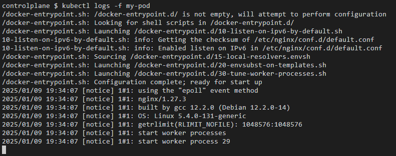

## Exercício 1

Crie um pod chamado "my-pod" usando uma imagem simples como "nginx" e verifique seu estado com os comandos de monitoramento do Kubernetes.

    
<i>Todos os recursos. Status do pod: running</i>

    
<i>Logs do pod</i>

