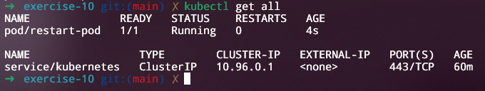
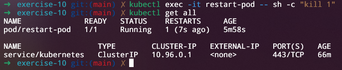

## Exercício 10

Crie um pod chamado "restart-pod" com a política de reinício configurada como "OnFailure". Provoque uma falha no pod e observe seu comportamento.

<div align="center">
    <p><i>Todos os recursos</i></p>
</div>

```bash
kubectl exec -it restart-pod -- sh -c "kill 1"
```

<div align="center">
    <p><i>Comando para encerrar o processo de ID 1 dentro do pod, e isso causará uma falha</i></p>
</div>

<div align="center">
    <p><i>O pod foi reiniciado logo após o uso do comando</i></p>
</div>
