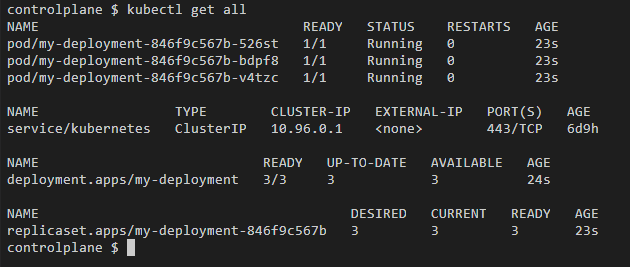
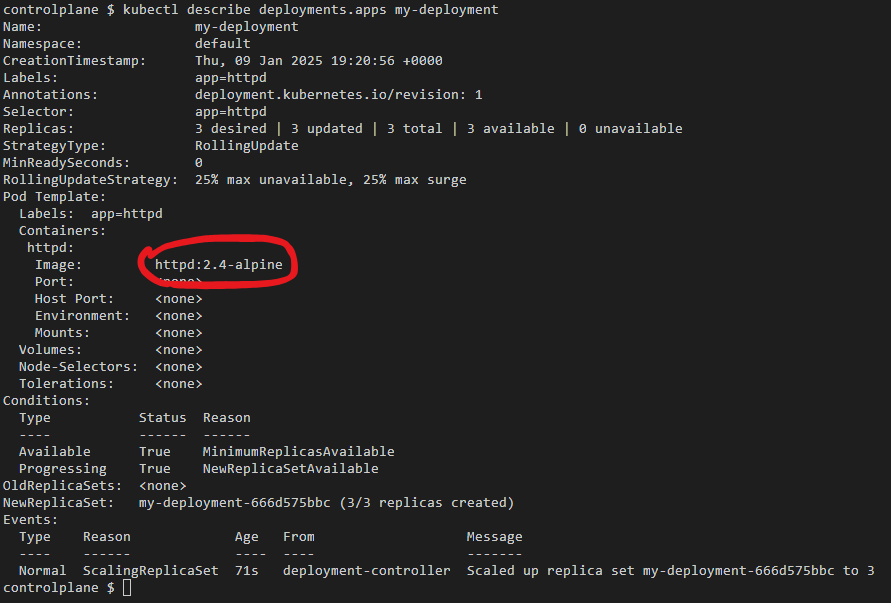
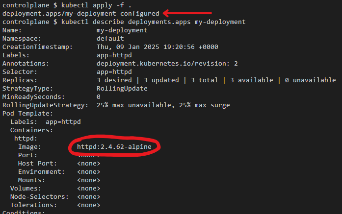

## Exercício 2

Implante um Deployment chamado "my-deployment" com três réplicas de uma aplicação baseada na imagem "httpd". Atualize a imagem do Deployment para uma versão mais recente.

    
<i>Todos os recursos</i>

    
<i>Checando versão atual do Deployment</i>

    
<i>Atualizando o Deployment, e checando a nova versão</i>

