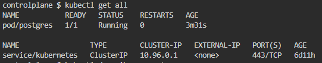
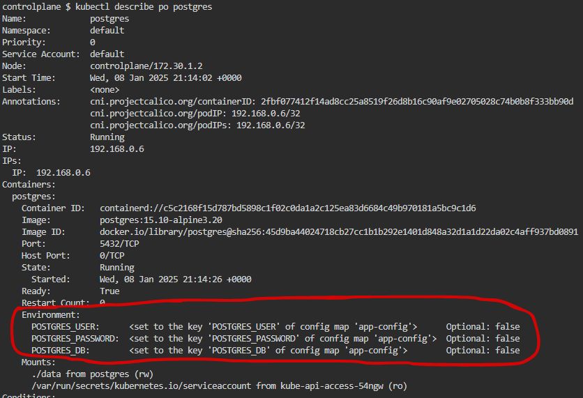

## Exercício 3

Crie um ConfigMap chamado "app-config" com uma variável de configuração personalizada. Monte o ConfigMap em um pod e verifique se o valor foi aplicado corretamente.

    
<i>Todos os recursos</i>

    
<i>Checando as chaves do ConfigMap, que foram utilizadas como variáveis de ambiente</i>

