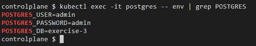

## Exercício 4

Crie um Secret chamado "app-secret" contendo informações sensíveis. Injete o Secret como uma variável de ambiente em um pod e teste se está acessível.

    
<i>Todos os recursos</i>

    
<i>Checando as secrets que foram utilizadas como variáveis de ambiente</i>

    
<i>Acessando as variáveis de ambiente que foram inseridas no container do PostgreSQL, já decodificadas a partir de código em base64</i>

