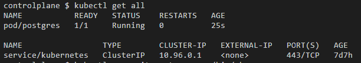
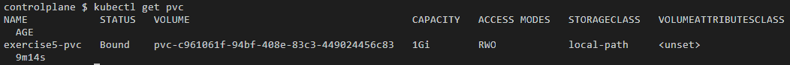
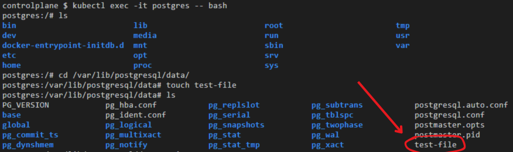
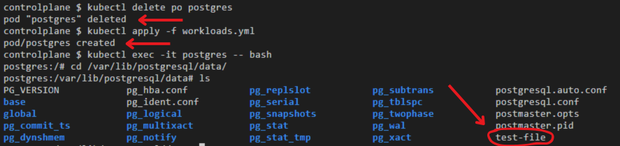

## Exercício 5

Configure um PersistentVolume de 1Gi de armazenamento local e vincule-o a um PersistentVolumeClaim. Monte o volume em um pod e salve arquivos para verificar a persistência.

    
<i>Todos os recursos</i>

    
<i>PersistentVolumeClaim</i>

    
<i>Adicionando um arquivo ao volume persistente</i>

    
<i>Deletando e recriando o pod que armazena o volume, e checando se o arquivo foi persistido</i>

