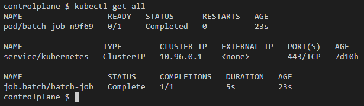
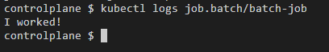

## Exercício 7

Implante um Job chamado "batch-job" que execute um comando simples e termine. Verifique os logs do Job para confirmar sua execução.

    
<i>Todos os recursos</i>

    
<i>Logs do job executado</i>

