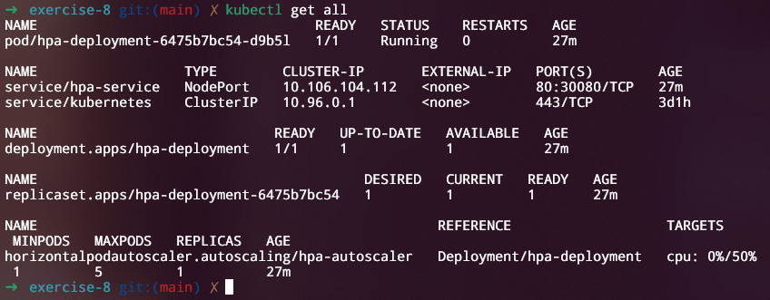
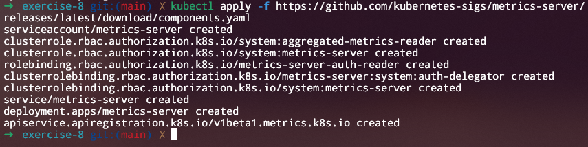
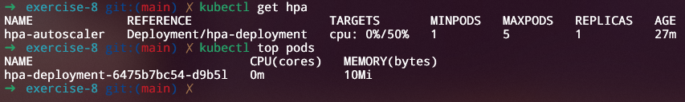
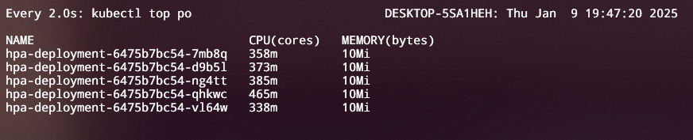
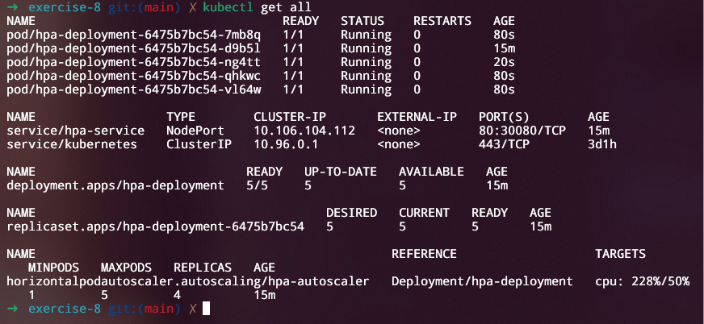

## Exercício 8

Crie um Horizontal Pod Autoscaler para um Deployment chamado "hpa-deployment" e configure-o para escalar com base no uso de CPU. Aumente a carga e observe o escalonamento.

<div align="center">
    <p><i>Todos os recursos antes do escalonamento</i></p>
</div>
<div align="center">
    <p><i>Instalando o Metrics Server para monitorar o escalonamento</i></p>
</div>
<div align="center">
    <p><i>Métricas antes de iniciar o teste de carga</i></p>
</div>

```bash
sudo apt install -y hey
hey -z 5m -c 50 http://localhost:30080
```

<div align="center">
    <p><i>Comandos para instalar e iniciar o teste de carga</i></p>
</div>
<div align="center">
    <p><i>Novos pods foram levantados devido ao uso intensivo de CPU após iniciar o teste de carga</i></p>
</div>

<div align="center">
    <p><i>Todos os recursos após o escalonamento</i></p>
</div>
