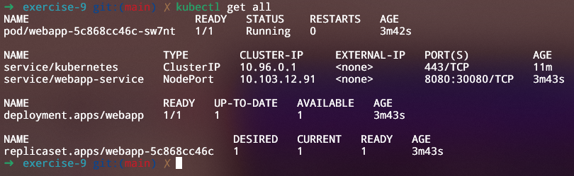
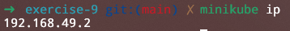
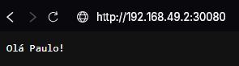

## Exercício 9

Crie um serviço do tipo NodePort para expor externamente um Deployment chamado "webapp". Acesse o serviço usando o endereço IP do Minikube e a porta atribuída.

    
<i>Todos os recursos</i>

    
<i>Pegando o endereço IP do Minikube</i>

    
<i>Acessando o serviço pelo navegador utilizando o endereço IP do Minikube e a porta atribuída</i>

